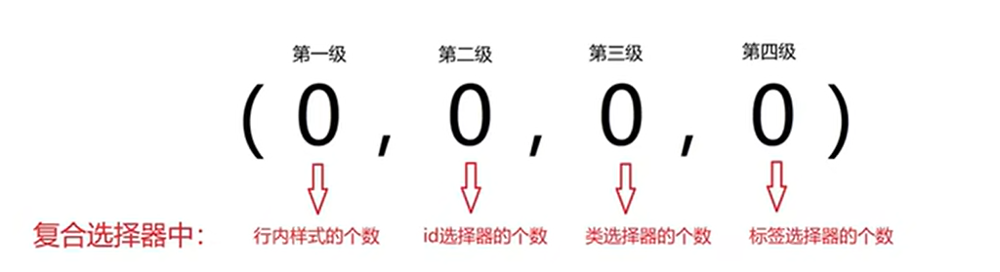
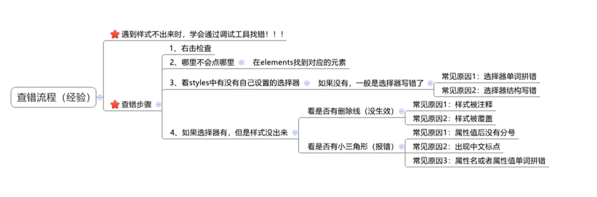
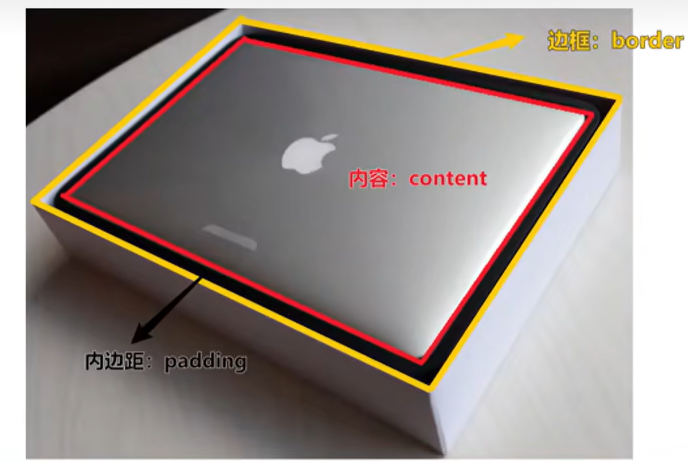
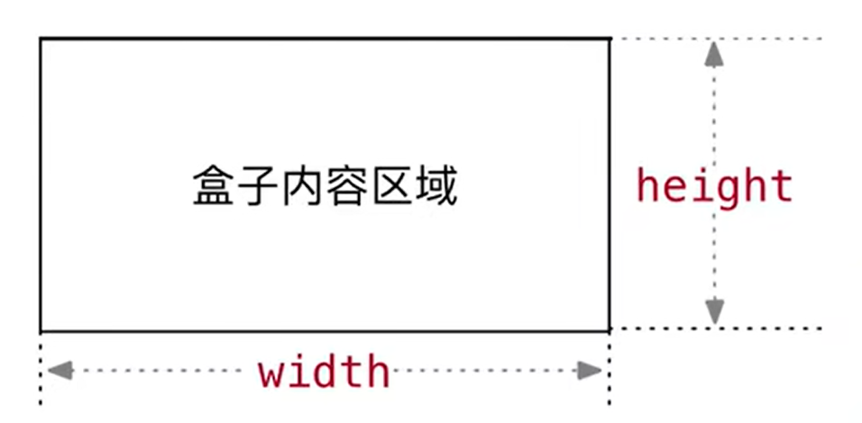
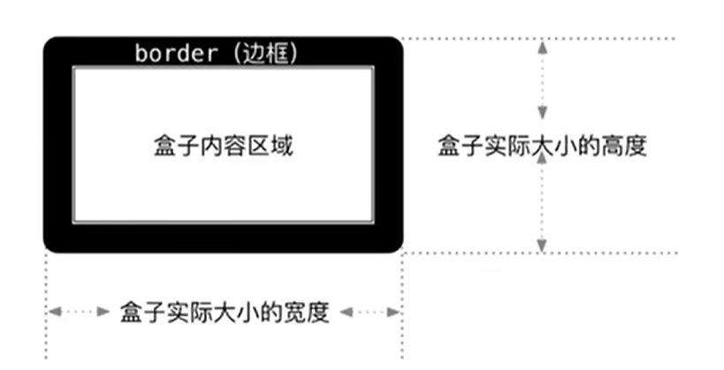

# CSS三大特性

## 学习路径：

1. 继承性
2. 层叠性
3. **优先级**

## 优先级

### 介绍

特性：不同选择器具有不同的优先级，优先级高的选择器样式会覆盖优先级低选择器样式

优先级公式：

- 继承 < 通配符选择器 < 标签选择器 < 类选择器 < id选择器 < 行内选择器 < !important

注意点：

1. !important写在属性值的后面，分号的前面！
2. !important不能提升继承的优先级，**只要是继承优先级最低！**
3. 实际开发中不建议使用!important。

**谁更精准的选中标签，谁的优先级更高！**

### 权重叠加计算

场景：如果是复合选择器，此时需要通过权重叠加计算方法，判断最终哪个选择器优先级最高会生效

权重叠加计算公式：（每一级之间不存在进位）



比较规则：

1. 先比较第一级数字，如果比较出来了，之后的统统不看
2. 如果第一级数字相同，此时再去比较第二级数字，如果比较出来了，之后的统统不看
3. ……
4. 如果最终所有数字都相同，表示优先级相同，则比较层叠性（谁写在下面，谁说了算！）

注意点：!importanta如果不是继承，则权重最高，天下第一！

# Chrome调试工具

查错步骤



注意点：

- CSS代码上一行出错，会导致下一行受影响。

# 盒子模型

1. 盒子模型的介绍
2. 内容区域的宽度和高度
3. 边框（border）
4. 内边距（padding）
5. 外边距（margin）

## 介绍

1. 盒子的概念
    1. 页面中的每一个标签，都可看做是一个“盒子”，通过盒子的视角更方便的进行布局
    2. 浏览器在渲染网页时，会将网页中的元素看做是一个个的矩形区域，形象的称之为 盒子
2. 盒子模型
    - CSS中规定每个盒子分别由：内容区域（content）、内边距区域（padding）、边框区域（border）、外边距区域（margin）构成



## 内容的宽度和高度

作用：利用width和height属性默认设置是盒子 内容区域 的大小

属性：width/height

常见取值：数字+px



## 边框（border）-连写形式

属性名：border

参数：border：粗细 线条样式 颜色

属性值：单个取值的连写，取值之间以空格隔开

- 如：

- ```css
    border：10px solid red
    ```

    

快捷键：bd+tab

- 10px（线条的宽度）

- solid（线条的种类）：实线

- red（线条的颜色）：红色边框

| 线条   | 类型 |
| ------ | ---- |
| solid  | 实线 |
| dashed | 虚线 |
| dotted | 点线 |

还有其他线，但是其他浏览器可能不兼容，所以有其他线的话，可以切换成背景图片放置即可。

## 边框（border） - 单方向设置

场景：只给盒子的某个方向单独设置边框

属性名：border - 方位名词

属性值：连写的取值

单个属性： 

| 作用     | 属性名       | 属性值                               |
| -------- | ------------ | ------------------------------------ |
| 边框粗细 | border-width | 数字+px                              |
| 边框样式 | border-style | 实线 solid、虚线 dashed、点线 dotted |
| 边框颜色 | border-color | 颜色取值                             |

## 盒子实际大小初级计算公式

- 需求：盒子尺寸400*400，背景绿色，边框10px 实线 黑色，如何完成？
- 盒子实际大小初级计算公式：
- 解决：当盒子被border撑大后，如何满足需求？



## 新浪导航案例

需求：根据设计图，通过PxCook量取数据，通过代码在网页中完成一致的效果

布局顺序：

1. 从外往内，从上往下

每一个盒子的样式：

1. 宽高
2. 辅助的背景颜色
3. 盒子模型的部分：border、padding、margin
4. 其他样式：color、font-、text-……

